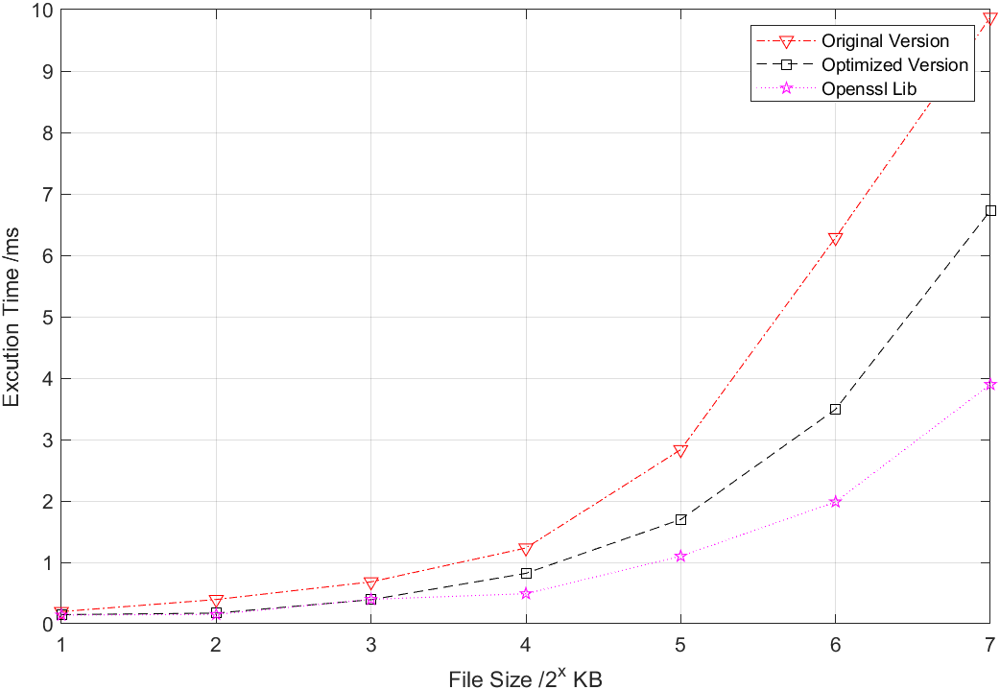
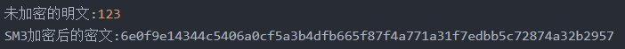

# SM3 implementation and optimization
## Efficiency comparison
<br>
<center>

</center>
<br>
<center>

</center>


---
## SM3 algorithm overview
SM3 cryptographic hash algorithm is the Chinese commercial cryptographic hash algorithm standard published by China National cryptographic administration in 2010. The algorithm was published as the cryptographic industry standard (gm/t 0004-2012) in 2012 and the national cryptographic hash algorithm standard (gb/t32905-2016) in 2016.  
SM3 is suitable for digital signature and verification in commercial cryptographic applications. It is an improved algorithm based on SHA-256, and its security is equivalent to SHA-256. The iterative process of Sm3 and MD5 is similar, and the Merkle damgard structure is also adopted. The message packet length is 512 bits, and the summary value length is 256 bits.  
### Message population
The message expansion step of Sm3 takes 512 bit data packets as input. Therefore, we need to fill the data length to a multiple of 512 bits at the beginning.  
### Message extension
The filled messages are grouped by 512 bits. First, a 512 bit data packet is divided into 16 message words. It is expanded from 16 message words to 132 message words.  
### Compression function
Omit. Please check the original literature for details  

## SM3 algorithm implementation (original)
### Initialization function
```c++
void SM3Init(SM3::SM3Context *context) {
	context->intermediateHash[0] = 0x7380166F;
	context->intermediateHash[1] = 0x4914B2B9;
	context->intermediateHash[2] = 0x172442D7;
	context->intermediateHash[3] = 0xDA8A0600;
	context->intermediateHash[4] = 0xA96F30BC;
	context->intermediateHash[5] = 0x163138AA;
	context->intermediateHash[6] = 0xE38DEE4D;
	context->intermediateHash[7] = 0xB0FB0E4E;
}
```
### Constant vector T
```c++
unsigned int T(int i){
	if (i >= 0 && i <= 15)          return 0x79CC4519;
	else if (i >= 16 && i <= 63)    return 0x7A879D8A;
	else                            return 0;
}
```
### Boolen function
```c++
unsigned int FF(unsigned int X, unsigned int Y, unsigned int Z, int i){//FF
	if (i >= 0 && i <= 15)		return X ^ Y ^ Z;
	else if (i >= 16 && i <= 63)	return (X & Y) | (X & Z) | (Y & Z);
	else				return 0;
}

unsigned int GG(unsigned int X, unsigned int Y, unsigned int Z, int i){//GG
	if (i >= 0 && i <= 15)		return X ^ Y ^ Z;
	else if (i >= 16 && i <= 63)	return (X & Y) | (~X & Z);
	else				return 0;
}
```
### Permutation function P0/P1
```c++
unsigned int P0(unsigned int X):	return X ^ LeftRotate(X,  9) ^ LeftRotate(X, 17);
unsigned int P1(unsigned int X):	return X ^ LeftRotate(X, 15) ^ LeftRotate(X, 23);
```

### Reverse byte
In SM3 algorithm, words are stored in big endian format, so bytes should be inverted.  
```c++
unsigned int *ReverseWord(unsigned int *word){
	unsigned char *byte, temp;
	byte = (unsigned char *)word;
	temp = byte[0];
	byte[0] = byte[3];
	byte[3] = temp;

	temp = byte[1];
	byte[1] = byte[2];
	byte[2] = temp;
	return word;
}
```
### Message filling: 
Fill the data length to a multiple of 512 bits.The length takes up 8 bytes according to the big end method, and only the length within 2^32 - 1 (unit: bit) is considered, * so the higher 4 bytes are assigned to 0.  
```c++
bitLen = messageLen * 8;
if (IsLittleEndian())	ReverseWord(&bitLen);
memcpy(context.messageBlock, message + i * 64, remainder);
context.messageBlock[remainder] = 0x80;//Add bit '0x1000 0000' to the end
if (remainder <= 55){//If the number of bits left is less than 440
	memset(context.messageBlock + remainder + 1, 0, 64 - remainder - 1 - 8 + 4);
	memcpy(context.messageBlock + 64 - 4, &bitLen, 4);
	hash_rate += 1;//Calculate the last short block
	SM3ProcessMessageBlock(&context);
}
else{
	memset(context.messageBlock + remainder + 1, 0, 64 - remainder - 1);
	hash_rate += 1;
	SM3ProcessMessageBlock(&context);
	memset(context.messageBlock, 0, 64 - 4);
	memcpy(context.messageBlock + 64 - 4, &bitLen, 4);
	hash_rate += 1;//Calculate the last short block
	SM3ProcessMessageBlock(&context);
}
```
### Message extend
```c++
for (i = 0; i < 16; i++){
	W[i] = *(unsigned int *)(context->messageBlock + i * 4);
	if (IsLittleEndian())		ReverseWord(W + i);
}
for (i = 16; i < 68; i++)
	W[i] = (W[i - 16] ^ W[i - 9] ^ LeftRotate(W[i - 3], 15)) ^ LeftRotate((W[i - 16] ^ W[i - 9] ^ LeftRotate(W[i - 3], 15)), 15) ^ LeftRotate((W[i - 16] ^ W[i - 9] ^ LeftRotate(W[i - 3], 15)), 23)^ LeftRotate(W[i - 13], 7)^ W[i - 6];
			
for (i = 0; i < 64; i++)	W_[i] = W[i] ^ W[i + 4];

```

### Compress function
```c++
	A = context->intermediateHash[0];	B = context->intermediateHash[1];
	C = context->intermediateHash[2];	D = context->intermediateHash[3];
	E = context->intermediateHash[4];	F = context->intermediateHash[5];
	G = context->intermediateHash[6];	H = context->intermediateHash[7];
	
	for (i = 0; i < 64; i++){
		unsigned int SS3;
		SS1 = LeftRotate((LeftRotate(A, 12) + E + LeftRotate(T(i), i)), 7);
		SS2 = SS1 ^ LeftRotate(A, 12);
		TT1 = FF(A, B, C, i) + D + SS2 + W_[i];
		TT2 = GG(E, F, G, i) + H + SS1 + W[i];

		D = C;				C = LeftRotate(B, 9);
		B = A;				A = TT1;
		H = G;				G = LeftRotate(F, 19);
		F = E;				E = TT2 ^ LeftRotate(TT2, 9) ^ LeftRotate(TT2, 17);
	}
	
	context->intermediateHash[0] ^= A;	context->intermediateHash[1] ^= B;
	context->intermediateHash[2] ^= C;	context->intermediateHash[3] ^= D;
	context->intermediateHash[4] ^= E;	context->intermediateHash[5] ^= F;
	context->intermediateHash[6] ^= G;	context->intermediateHash[7] ^= H;
```
## SM3 algorithm optimization
### Optimization direction One: Rapid implementation of message expansion
Optimized implementation:  
Before executing the 64 round compression function, only the initial four words are calculated, and the rest are calculated in each round of compression function. Wi+4 is generated in round I of the compression function, and w1'is replaced by wi^wi+4.  


Optimization principle:  
Before optimization:  
1. When calculating the first 16 wi, each needs to execute one load and one store, and when calculating the last 52 wi, each needs to execute five times of load, one time of store, six times of XOR and one time of rot;  
2. Calculate 64 wi, each of which needs to execute 2 loads, 1 store and 1 rot;  
After optimization:  
1. When calculating the first 12 wi+4, each needs to perform one load and one save. When calculating the last 52 wi+4, each needs to perform five loads, one store, six XORs, and four rots;  
It mainly reduces the access operation when calculating and storing W'. In the test, the optimization also improves the execution speed of the algorithm.  

```python
if (i < 12) {
	W[i+4] = *(unsigned int *)(context->messageBlock + (i+4) * 4);
	if (IsLittleEndian())	ReverseWord(W + i + 4);
	}
else {
	W[i+4] = ((W[i - 12] ^ W[i - 5] ^ LeftRotate(W[i + 1], 15)) ^ LeftRotate((W[i - 12] ^ W[i - 5] ^ LeftRotate(W[i + 1], 15)), 15) ^ LeftRotate((W[i - 12] ^ W[i - 5] ^ LeftRotate(W[i + 1], 15)), 23))^ LeftRotate(W[i - 9], 7)^ W[i - 2];
	}

```

### Optimization direction Two: Precomputation constant
Constants are pre calculated and stored. This can avoid the constant shift operation for each message packet, and the storage space occupied after optimization is also small, only 256 bytes.  
```python
unsigned int T(int i){
	if (i >= 0 && i <= 15)		return 0x79CC4519;
	else if (i >= 16 && i <= 63)	return 0x7A879D8A;
	else				return 0;
}

void caculT() {
	for (int i = 0; i < 64; i++) 	t[i] = LeftRotate(T(i),i);
	return ;
}
```

### Optimization direction Three: Structural adjustment of compression function
At the end of each round of the compression function, a circular right shift will be executed. Move the word cycle to the right to change the order of input words in each round, and this order change will be restored after 4 rounds, as shown in the figure.  
```python
for (i = 0; i <= 60; i+=4) {
	one_round(i, A, B, C, D, E, F, G, H, W, context);
	one_round(i+1, D, A, B, C, H, E, F, G, W, context);
	one_round(i+2, C, D, A, B, G, H, E, F, W, context);
	one_round(i+3, B, C, D, A, F, G, H, E, W, context);
	}
```

### Optimization direction Four: Optimize the generation process of intermediate variables of compression function
Unnecessary assignment is removed and the number of intermediate variables is reduced. After the optimization of methods 3 and 4, only D, h, B and F can be updated, reducing the assignment operation.  
The structure of the compression function is adjusted to greatly reduce the number of loads and stores, while the optimization of intermediate variables TT1 and TT2 further reduces the number of rot.  
```python
TT2 = LeftRotate(A, 12);
TT1 = TT2 + E + t[i];
TT1 = LeftRotate(TT1, 7);
TT2 ^= TT1;

D = D + FF(A, B, C, i) + TT2 + (W[i] ^ W[i + 4]);
H = H + GG(E, F, G, i) + TT1 + W[i];
B = LeftRotate(B, 9);
F = LeftRotate(F, 19);
H = H ^ LeftRotate(H, 9) ^ LeftRotate(H, 17);
```

---
### Optimization direction Five: GPU's parallel optimization of GPU(It cannot be well combined with the above directions for the time being and It seems a little superfluous.)
SM3's optimal implement by using GPU. SM3 is 256-bit cryptographic hash algorithm derived from SHA-2 designed by the NSA.   
It was designed by Xiaoyun Wang who is responsible for discovering attacks against many cryptographic hash functions, most notably MD5 and SHA-1. 

```python
*Macros and data types  
#define R(v,n)(((v)<<(n))|((v)>>(32-(n))))  
#define F(n)for(i=0;i<n;i++)  

#define rev32(x) __builtin_bswap32(x)  
#define rev64(x) __builtin_bswap64(x)  
  
typedef unsigned long long Q;  
typedef unsigned int W;  
typedef unsigned char B;  

typedef struct _sm3_ctx {  
    W s[8];  
    union {  
      B b[64];  
      W w[16];  
      Q q[8];  
    }x;  
    Q len;  
}sm3_ctx;  
```

 ### Initialization    
 ```python
 void sm3_init(sm3_ctx*c) {    
    c->s[0]=0x7380166f;  c->s[1]=0x4914b2b9;  
    c->s[2]=0x172442d7;  c->s[3]=0xda8a0600;  
    c->s[4]=0xa96f30bc;  c->s[5]=0x163138aa;  
    c->s[6]=0xe38dee4d;  c->s[7]=0xb0fb0e4e;  
    c->len =0;  
}  
```
### Updating context    
 Updating the buffer and state is exactly the same as SHA-2 that is based on the original design for MD4 by Ron Rivest.   
 Once the buffer has 64-bytes of data, it's processed using sm3_compress.  
```python
  void sm3_update(sm3_ctx*c,const void*in,W len) {  
    B *p=(B*)in;  
    W i, idx;  
    
    idx = c->len & 63;  
    c->len += len;  
    
    for (i=0;i<len;i++) {  
      c->x.b[idx]=p[i]; idx++;  
      if(idx==64) {  
        sm3_compress(c);  
        idx=0;  
      }  
    }  
}  
```
### Finalization  
 This step is also the exact same as SHA-2.
```python
 void sm3_final(void*h,sm3_ctx*c) {
    W i,len,*p=h;
    
    i = len = c->len & 63;
    while(i<64) c->x.b[i++]=0;
    c->x.b[len]=0x80;
    
    if(len>=56) {
      sm3_compress(c);
      F(16)c->x.w[i]=0;
    }
    c->x.q[7]=rev64((Q)c->len*8);
    sm3_compress(c);
    F(8)p[i]=rev32(c->s[i]);
}
```
### Compression  
```python
 void sm3_compress(sm3_ctx*c) {
    W t1,t2,i,j,t,s1,s2,x[8],w[68];

    // load data
    F(16)w[i]=rev32(c->x.w[i]);
    // expand
    for(i=16;i<68;i++)
      w[i]=P1(w[i-16]^w[i-9]^R(w[i-3],15))^R(w[i-13],7)^w[i- 6];

    // load internal state
    F(8)x[i]=c->s[i];
    
    // compress data
    F(64) {
      t=(i<16)?0x79cc4519:0x7a879d8a;
      s2=R(x[0],12);      
      s1=R(s2+e+R(t,i),7);
      s2^=s1;
      if(i<16) {
        t1=F1(x[0],x[1],x[2])+x[3]+s2+(w[i]^w[i+4]);  
        t2=F1(x[4],x[5],x[6])+x[7]+s1+w[i];
      } else {
        t1=FF(x[0],x[1],x[2])+x[3]+s2+(w[i]^w[i+4]);
        t2=GG(x[4],x[5],x[6])+x[7]+s1+w[i];      
      }
      x[3]=x[2];x[2]=R(x[1],9);x[1]=x[0];x[0]=t1;
      x[7]=x[6];x[6]=R(x[5],19);x[5]=x[4];x[4]=P0(t2);     
    }
    // update internal state
    F(8)c->s[i]^=x[i];}
```
